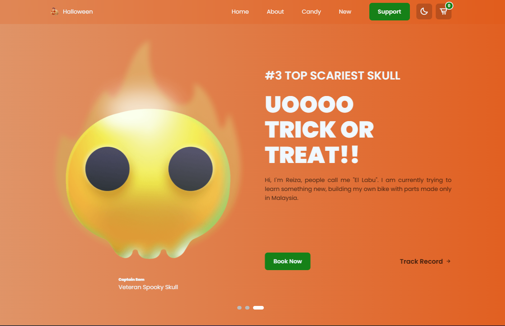
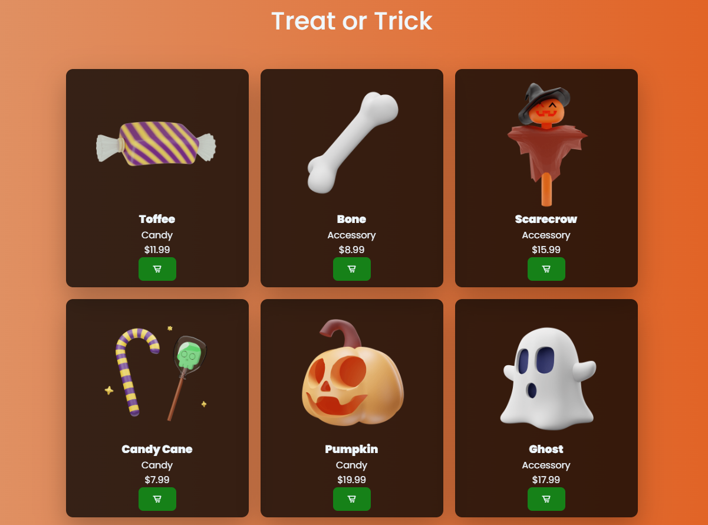

# Halloween Landing Page

Landing page responsive con tematica de Halloween, animaciones suaves, productos de temporada, carrito funcional y modo oscuro. El proyecto esta construido con HTML, CSS y JavaScript vanilla.



## Caracteristicas

- Slider principal con controles y autoplay.
- Animaciones suaves al cargar la pagina.
- Secciones que aparecen progresivamente al hacer scroll.
- Catalogo de productos de Halloween.
- Carrito con contador en el header.
- Modal lateral del carrito con imagen, nombre, precio, descripcion, cantidades y total.
- Modo naranja/oscuro con preferencia guardada en el navegador.
- Menu responsive para pantallas pequenas.
- Formulario de newsletter con validacion basica.

## Vista de productos



## Tecnologias

- HTML5
- CSS3
- JavaScript
- Boxicons
- Google Fonts

## Estructura

```text
landingpagehalloween/
|-- css/
|   `-- index.css
|-- img/
|   |-- readme/
|   |   |-- home-preview.png
|   |   `-- products-preview.png
|   `-- ...
|-- js/
|   `-- index.js
|-- index.html
|-- package.json
`-- README.md
```

## Como usar

1. Instala las dependencias:

```bash
npm install
```

2. Abre `index.html` directamente en el navegador.

Tambien puedes usar una extension como Live Server si quieres recarga automatica durante el desarrollo.

## Scripts

```bash
npm run lint:html
npm run lint:css
npm run lint:js
```

## Estado de revision

Los lints de JavaScript y CSS pasan correctamente. El lint de HTML termina sin errores, aunque puede mostrar una advertencia del servicio externo `html-checker` cuando no devuelve JSON valido.

## Agradecimiento

Gracias a **Franklin369** por la inspiracion y la tematica de Halloween que dio vida al estilo visual del proyecto.
